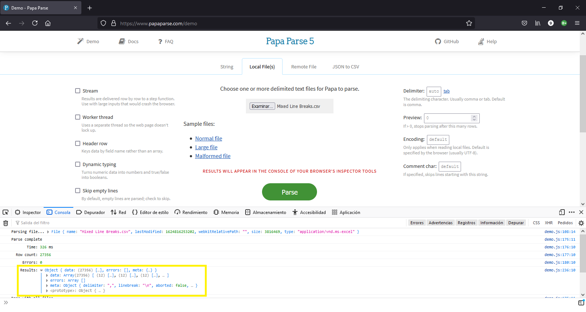
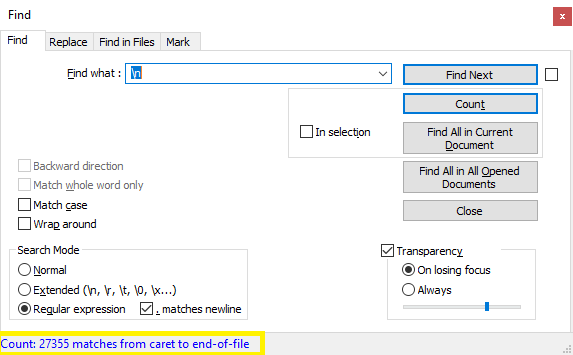
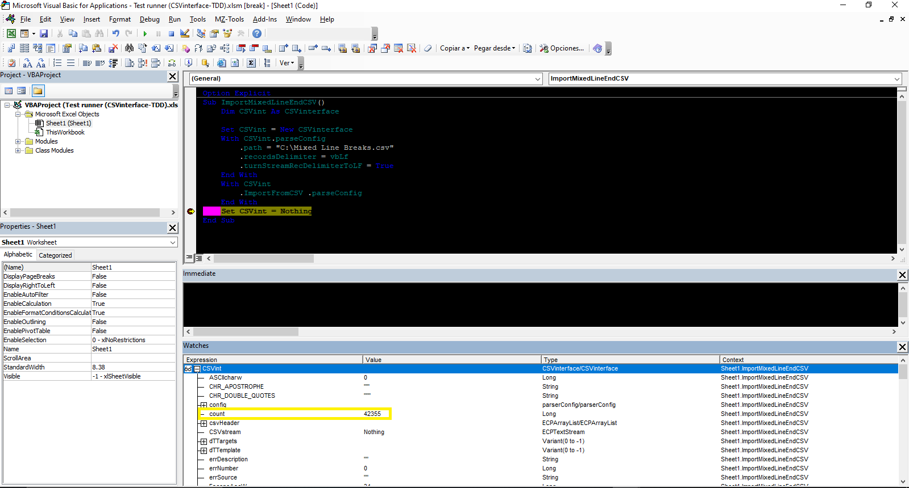

## Data subsetting

The \[EXAMPLE1\] shows how you can execute a like SQL simple query over a CSV file and dump result to a worksheet. The `queryFilters` is an array of the requirements that the `keyIndex` field must meet to be retrieved from the file.

#### [EXAMPLE1]
```vb
Private Sub Query_CSV(path As String, ByVal keyIndex As Long, queryFilters As Variant)
    Dim CSVint As CSVinterface
    Dim CSVrecords As ECPArrayList
    Dim keyIndex As Long
    
    Set CSVint = New CSVinterface
    If path <> vbNullString Then
        Set CSVrecords = CSVint.GetCSVsubset(path, queryFilters, keyIndex) 'data filtered on keyIndex th field
        CSVint.DumpToSheet DataSource:=CSVrecords 'dump result
        Set CSVint = Nothing
        Set CSVrecords = Nothing
    End If
End Sub
```

The \[EXAMPLE2\] shows how you can split CSV data into a set of files with related data.

#### [EXAMPLE2]
```vb
Sub CSVsubSetting(path As String)
    Dim CSVint As CSVinterface
    Dim path As String
    Dim subsets As Collection

    Set CSVint = New CSVinterface
    Set subsets = CSVint.CSVsubsetSplit(path, 2) 'Relationship in the second field
    Set CSVint = Nothing
    Set subsets = Nothing
End Sub
```

In some situations we may encounter a CSV file with a combination of `vbCrLf`, `vbCr` and `vbLf` as record delimiters. This can happen for many reasons, but the most common is by adding data to an existing CSV file without checking the configuration of the previously stored information. These cases will break the logic of many robust CSV parsers, including the 737K weekly downloaded [Papa Parse](https://www.papaparse.com/). 

To demonstrate this problem, there is a file called *"Mixed Line Breaks.csv "* included in the [CSV assets](https://github.com/ws-garcia/VBA-CSV-interface/raw/master/csv-data/assets.zip) that mimics a CSV with mixed record delimiters. Opening the example file in [Notepad++](https://notepad-plus-plus.org/), we can see that it contains 42,355 records and when we try to parse it with Papa Parse we get a data object with 27,356 records. 



Matt Holt's parser determines that the file has the `\n` character as a record delimiter, this is because the sample file has 14,999 records ending in the `\n` character as the start, followed by 14,999 records ending in the `\r` character and 12,356 records ending in `\r\n`. Thus, the number of records returned by Papa Parse is the sum of `1 + 14,999 + 12,356 = 27,356` (see image below).



 The \[EXAMPLE3\] shows how you can import CSV files with mixed line break as record delimiter, a new option that uses the `turnStreamRecDelimiterToLF` property of the [`parseConfig`](https://ws-garcia.github.io/VBA-CSV-interface/api/properties/parseconf.html) object to work with these special CSV files.
 
 #### [EXAMPLE3]
```vb
Sub ImportMixedLineEndCSV()
    Dim CSVint As CSVinterface
            
    Set CSVint = New CSVinterface
    With CSVint.parseConfig
        .path = "C:\Mixed Line Breaks.csv"
        .recordsDelimiter = vbLf 'All delimiters will be turned into vbLf
        .turnStreamRecDelimiterToLF = True
    End With
    With CSVint
        .ImportFromCSV .parseConfig
    End With
    Set CSVint = Nothing
End Sub
```

>⚠️**Caution**
>{: .text-grey-lt-000 .bg-green-000 }
>Converting delimiters to `vbLf` is an overheating operation. Use this functionality only after confirming that you cannot import your file using other methods.
{: .text-grey-dk-300 .bg-yellow-000 }

After executing the \[EXAMPLE3\] we obtain the correct number of records, as shown in the following image.

