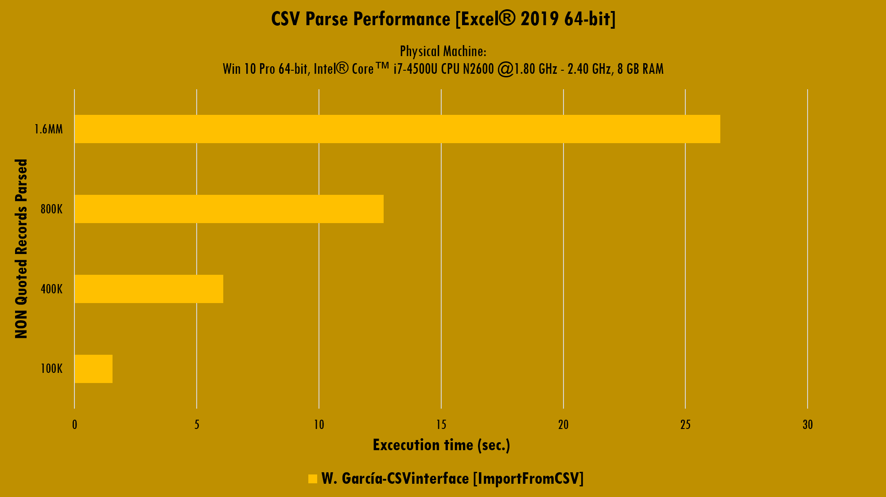
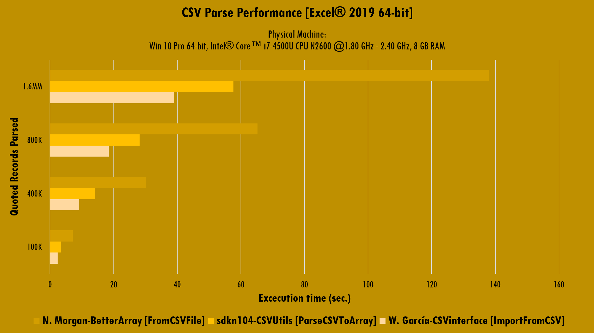
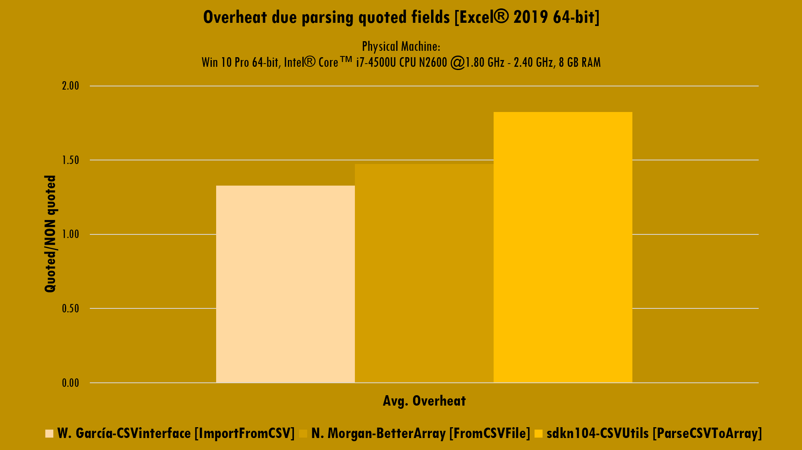

# Getting Started
{: .fs-9 }

---

{: .no_toc }

<details open markdown="block">
  <summary>
    Table of contents
  </summary>
  {: .text-delta }
1. TOC
{:toc}
</details>

In order to be able to use CSV interface library within your project, please review the installation instructions by clicking the button below.

[Installation](https://ws-garcia.github.io/VBA-CSV-interface/home/installation.html){: .btn .btn-green }

The CSV files are special kind of tabulated plain text data container widely used in data exchange. There is no globally accepted standard format for that kind of files, however, out there are well formed specs such as the [RFC-4180](https://www.ietf.org/rfc/rfc4180.txt) proposed by The Internet Society.
Although many solutions has been developed for work with CSV files into VBA, including projects from [@sdkn104](https://github.com/sdkn104/VBA-CSV) and [@Senipah](https://github.com/Senipah/VBA-Better-Array) on GitHub, we were tempted to develop a set of pure VBA class modules that serve as interface between users and CSV files and offer a lots of useful features.

## Philosophy
Starting on the version 3 of the VBA CSV interface library, the design philosophy changes from speed to usefulness and power when working with "big" files through streams. Despite this, the library still been the faster CSV/TSV file parser in VBA.

## Usage
Import whole CSV/TSV file into a VBA array:


```vb
Dim CSVint As CSVinterface
Dim conf As parserConfig
Dim Arr() As Variant

Set CSVint = New CSVinterface
Set conf = CSVint.ParseConfig
With conf
    .path = "C:\100000.quoted.csv"
    .dynamicTyping = False
End With
CSVint.GuessDelimiters conf
CSVint.ImportFromCSV(conf).DumpToArray Arr
```

Sort CSV/TSV file's content and put it into a VBA array:

```vb
Dim CSVint As CSVinterface
Dim conf As parserConfig
Dim Arr() As Variant

Set CSVint = New CSVinterface
Set conf = CSVint.ParseConfig
With conf
    .path = "C:\100000.quoted.csv"
    .dynamicTyping = False
End With
CSVint.GuessDelimiters conf
CSVint.ImportFromCSV(conf).Sort(SortColumn:=1, Descending:=True).DumpToArray Arr
```

Import a range of records from a CSV/TSV file into a VBA array:

```vb
Dim CSVint As CSVinterface
Dim conf As parserConfig
Dim Arr() As Variant

Set CSVint = New CSVinterface
Set conf = CSVint.ParseConfig
With conf
    .startingRecord = 10
    .endingRecord = 20
    .path = "C:\100000.quoted.csv"
    .dynamicTyping = False
End With
CSVint.GuessDelimiters conf
CSVint.ImportFromCSV(conf).DumpToArray Arr
```

Access to the first field of the first record from the imported data:

```vb
Dim Element as Variant

Element = CSVint(0, 0)
```

Set the delimiters characters pack used on guessing operations:

```vb
Dim conf As parserConfig
Dim Delimiters() As String

Redim Delimiters(0 To 3): Delimiters(0) = ",": _
                          Delimiters(1) = ";": _
                          Delimiters(2) = vbTab: _
                          Delimiters(3) = "|"
Set conf = New parserConfig
conf.delimitersToGuess = Delimiters
```

Configure Dynamic Typing:

```vb
With conf
    .dynamicTyping = True
    .defineTypingTemplate TypeConversion.ToDate, _
                          TypeConversion.ToLong, _
                          TypeConversion.ToDate, _
                          TypeConversion.ToLong, _
                          TypeConversion.ToDouble, _
                          TypeConversion.ToDouble, _
                          TypeConversion.ToDouble
    .defineTypingTemplateLinks 6, _
                               7, _
                               8, _
                               9, _
                               10, _
                               11, _
                               12
End With
```

Set the char to escape special fields:

```vb
conf.escapeToken = EscapeTokens.DoubleQuotes
conf.escapeToken = EscapeTokens.Apostrophe
conf.escapeToken = EscapeTokens.NullChar
```

Set fields and records delimiters:

```vb
conf.fieldsDelimiter = ";"
conf.recordsDelimiter = vbCrLf
```

>⚠️**Caution**
>{: .text-grey-lt-000 .bg-green-000 }
>Keep in mind that the class doesn't distinguish between numbers, dates, booleans and strings, all data is read as text and you need to define a well-formed Typing Template and its targets in order to format each data field.
{: .text-grey-dk-300 .bg-yellow-000 }

## Benchmark

>📝**Note**
>{: .text-grey-lt-000 .bg-green-000 }
>Since the version 3 of the VBA CSV interface library, we adopted the `ECPArrayList` class for internals data storage.
{: .text-grey-dk-300 .bg-grey-lt-000 }

The benchmark provided here is focused on the supposed most critical operation, this is the parse one for many authors.

The class was tested against two solutions (the one from [@Senipah](https://github.com/Senipah/VBA-Better-Array) and the other from [@sdkn104](https://github.com/sdkn104/VBA-CSV)) using a laptop running `Win 10 Pro x64, Intel® Core™ i7-4500U CPU @1.80-2.40 GHz, 8 GB RAM, Excel 2019 x86`. We will call the import procedure over different files, increasing the file size, and the number of record per file, in each subsequent call. The CSV files are:

<table>
<thead>
<tr>
<th style="text-align: left;"><strong>File name (ALL fields quoted)</strong></th>
<th style="text-align: left;"><strong>File name (NON quoted fields)</strong></th>
</tr>
</thead>
<tbody>
<tr>
<td style="text-align: left;"><em>100000.quoted.csv</em></td>
<td style="text-align: left;"><em>100000.NON-quoted.csv</em></td>
</tr>
<tr>
<td style="text-align: left;"><em>400000.quoted.csv</em></td>
<td style="text-align: left;"><em>400000.NON-quoted.csv</em></td>
</tr>
<tr>
<td style="text-align: left;"><em>800000.quoted.csv</em></td>
<td style="text-align: left;"><em>800000.NON-quoted.csv</em></td>
</tr>
<tr>
<td style="text-align: left;"><em>1600000.quoted.csv</em></td>
<td style="text-align: left;"><em>1600000.NON-quoted.csv</em></td>
</tr>
</tbody>
</table>

>📝**Note**
>{: .text-grey-lt-000 .bg-green-000 }
>The quoted files are those have each field enclosed in double quotes ("). The main objective of this test is to measure the performance of the different procedures against the possible configurations of a CSV file.
>
>The test results can help answer the following questions: does the number of fields to be escaped affect the performance of the procedure? If yes, in what magnitude?
{: .text-grey-dk-300 .bg-grey-lt-000 }

The images below shows the overall performance for the imports operations from the tested procedures:





The benchmarks from the above charts are compared in the following chart:



Finally, the below chart shows the overheat for the Sorting and Dynamic Typing operations. These features are available on the VBA CSV interface since its version 3.


### Conclusions

- `ImportFromCSV` is the tested faster one import method when working with files with a great number of quoted fields.
- The CSV syntax slow-down the performance. When the number of escaped fields are increased, the performance decrease, this is especially noticeable for the @sdkn104 solution.
- The Dynamic Typing causes more overheat than the Sort operation. This can be explained by the great performance of the Yaroslavskiy sorting algorithm used. 

## Licence
Copyright (C) 2021  [W. García](https://github.com/ws-garcia/VBA-CSV-interface/).

This program is free software: you can redistribute it and/or modify it under the terms of the GNU General Public License as published by the Free Software Foundation, either version 3 of the License, or (at your option) any later version.

This program is distributed in the hope that it will be useful, but WITHOUT ANY WARRANTY; without even the implied warranty of MERCHANTABILITY or FITNESS FOR A PARTICULAR PURPOSE.  See the GNU General Public License for more details.

You should have received a copy of the GNU General Public License along with this program.  If not, see <https://www.gnu.org/licenses/gpl-3.0.html>.
