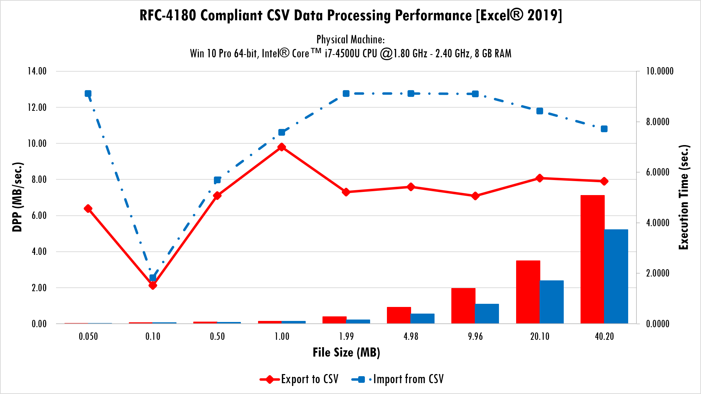
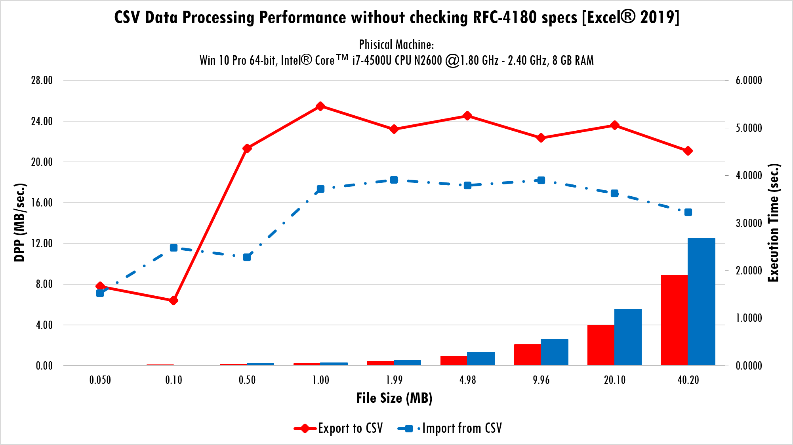

# Getting Started
{: .fs-9 }

---

{: .no_toc }

<details open markdown="block">
  <summary>
    Table of contents
  </summary>
  {: .text-delta }
1. TOC
{:toc}
</details>

In order to be able to use `CSVinterface.cls` module within your project, please review the installation instructions by clicking the button below.

[Installation](https://ws-garcia.github.io/VBA-CSV-interface/home/installation.html){: .btn .btn-green }

The CSV files are special kind of tabulated plain text data container widely used in data exchange. There is no globally accepted standard format for that kind of files, however, out there are well formed specs such as the [RFC-4180](https://www.ietf.org/rfc/rfc4180.txt) proposed by The Internet Society.
Although many solutions has been developed for work with CSV files into VBA, including projects from [@sdkn104](https://github.com/sdkn104/VBA-CSV) and [@Senipah](https://github.com/Senipah/VBA-Better-Array) on GitHub, the performance philosophy conduce me to the development of a VBA class module that allows users exchange data between VBA arrays and CSV files at superior speed for the VBA programing language, at time the proposed class supports TSV files as well.

## Philosophy
The VBA CSVinterface class module is designed for gain advantage from the well-structured CSV/TSV files, this means, there isn't automatic syntax check, given the user decide how the class will works. This can be seen as a weakness, but the class get a speed-up on writing and reading procedures at time the user controls how the file is interpreted, keeping in mind that, in fact, VBA is a language with slow code execution speed. Under this idealization the developed solution complies with the RFC-4180 specs for user specified CSV/TSV document format.

## Usage
Import whole CSV file into an VBA array

```vb
Dim CSVix As CSVinterface
Dim MyArray() As String
Set CSVix = New CSVinterface
Call CSVix.OpenConnection(fileName)
Call CSVix.ImportFromCSV
Call CSVix(MyArray) 'Dumps the data to array
Set CSVix = Nothing
```

Import a range of records from a CSV file into a VBA array

```vb
Dim CSVix As CSVinterface
Dim MyArray() As String
Set CSVix = New CSVinterface
CSVix.StartingRecord = 10
CSVix.EndingRecord = 20
Call CSVix.OpenConnection(fileName)
Call CSVix.ImportFromCSV
Call CSVix(MyArray) 'Dumps the data to array
Set CSVix = Nothing
```

Set the char to escape special fields

```vb
CSVix.EscapeChar = EscapeType.NullChar
CSVix.EscapeChar = EscapeType.Apostrophe
CSVix.EscapeChar = EscapeType.DoubleQuotes
```

Set fields and records delimiters

```vb
CSVix.FieldsDelimiter = ";"
CSVix.RecordsDelimiter = vbCrLf
```

Define the data processing behavior

```vb
CSVix.QuotingMode = QuotationMode.Critical 'default
CSVix.QuotingMode = QuotationMode.All
```

Get the encoding of the last opened CSV file

```vb
Dim ENC as String
ENC = CSVix.FileEncoding
```

>⚠️**Caution**
>{: .text-grey-lt-000 .bg-green-000 }
>Keep in mind that the class doesn't distinguish between numbers, dates and strings, all data is read as text and you can put in an Excel sheet to let Microsoft software format it.
{: .text-grey-dk-300 .bg-yellow-000 }

## Benchmark

>📝**Note**
>{: .text-grey-lt-000 .bg-green-000 }
>Since the v2.0.0 of the `CSVinterface` class we adopted the variant data Type array for internals data storage. Is well-known that this data Type has the worst performance in the VBA universe, but we desire bring to user the possibility to work with jagged arrays and let the class pay the cost in performance by that choice. 
>
>However, if you need more data processing performance and not want support to jagged arrays neither for TSV files, you can download [this version](https://github.com/ws-garcia/VBA-CSV-interface/releases/download/1.1.6/VBA-CSV-interface-1.1.6.zip) of the `CSVinterface` class.
{: .text-grey-dk-300 .bg-grey-lt-000 }

The benchmark provided here is focused on the supposed most critical operation, this is the parse one for many authors. Although, benchmark for the exportation procedure is given on. 

The class was tested against two solutions (the one from [@Senipah](https://github.com/Senipah/VBA-Better-Array) and the other from [@sdkn104](https://github.com/sdkn104/VBA-CSV)) using a laptop running `Win 10 Pro x64, Intel® Core™ i7-4500U CPU @1.80-2.40 GHz, 8 GB RAM, Excel 2019 x86`. The test works in two ways, 100K calls to the import procedure over three (3) different files, each of this with three records (3) and four fields (4), or one (1) call to the import procedure parsing a larger file. In all cases, the overall work load is 1.2MM of fields. The CSV files are:
* _RFC-4180_OH.csv_: **OH**- Only the headers are quoted (4 fields)
* _RFC-4180_HF.csv_: **HF**- Half of fields are quoted (6 fields)
* _RFC-4180_AF.csv_: **AF**- All fields are quoted (12 fields) 
* *Demo_400k_records.csv*: **LargeF**- 1.2MM fields.
* *Demo_Headed_400k_records.csv*: **LargeFQ**- 1.2MM fields sorrounded by double quotes.

First three of files have special chars (line breaks, commas, double quotes) into fields, also have trailing spaces at the field’s boundaries. The main objective of this test is to measure the performance of the different procedures against the possible configurations of a potential CSV file. The test results can help answer the following questions: does the number of fields to be escaped affect the performance of the procedure? If yes, in what magnitude? The test also includes benchmark for parse to a CSV file of considerable size.

<table>
<thead>
<tr>
<th style="text-align: left;"><strong>Procedure (Author)</strong></th>
<th style="text-align: right;"><strong>OH</strong></th>
<th style="text-align: right;"><strong>HF</strong></th>
<th style="text-align: right;"><strong>AF</strong></th>
<th style="text-align: right;"><strong>LargeF</strong></th>
<th style="text-align: right;"><strong>LargeFQ</strong></th>
</tr>
</thead>
<tbody>
<tr>
<td style="text-align: left;"><em>ImportFromCSVString<br>(W. García)</em></td>
<td style="text-align: right;"><p style="color:blue;">3.4297</p></td>
<td style="text-align: right;"><p style="color:blue;">3.4609</p></td>
<td style="text-align: right;"><p style="color:blue;">3.2031<br>1.3086</p></td>
<td style="text-align: right;"><p style="color:blue;">3.7266</p></td>
<td style="text-align: right;"><p style="color:blue;">5.0312<br>2.9492</p></td>
</tr>
<tr>
<td style="text-align: left;"><em>FromCSVString<br>(@Senipah)</em></td>
<td style="text-align: right;">14.9219</td>
<td style="text-align: right;">14.1914</td>
<td style="text-align: right;">14.2617</td>
<td style="text-align: right;">16.2227</td>
<td style="text-align: right;">22.9102</td>
</tr>
<tr>
<td style="text-align: left;"><em>ParseCSVToArray<br>(@sdkn104)</em></td>
<td style="text-align: right;">4.0898</td>
<td style="text-align: right;">4.6992</td>
<td style="text-align: right;">4.9688</td>
<td style="text-align: right;">8.0312</td>
<td style="text-align: right;">15.0938</td>
</tr>
</tbody>
</table>


>📝**Note**
>{: .text-grey-lt-000 .bg-green-000 }
>The above table shows the benchmark results, in seconds, for the currently tested procedures. The 2nd value, showed in some cells having two values, is obtained when setting the `QuotingMode` property to `QuotationMode.All`. 
{: .text-grey-dk-300 .bg-grey-lt-000 }

>⚠️**Caution**
>{: .text-grey-lt-000 .bg-green-000 }
>Keep in mind that not all CSV files can be successful imported by change the `QuotingMode` property.
{: .text-grey-dk-300 .bg-yellow-000 }

The images bellow shows the overall performance for the imports and exports operations from the CSV interface class. Notice, specials syntax CSV’s will sure take more time to be parsed due the parser has extra work to be done.





### Conclusions

- `ImportFromCSVString` is the tested faster one import method, outperforming its nearer counterpart by a 2x to 3x factor in performance.
- The CSV syntax slow-down the performance when the number of escaped fields, the number of white spaces between fields and the lines-breaks into fields are increased.
- When working with CSVs compliant with the RFC-4180 specs, the `ImportFromCSVString` method is faster than the `ExportToCSV` method. This scenario is inverted when working with well-formed CSVs without checking the RFC-4180 specs.

## Licence
Copyright (C) 2020  [W. García](https://github.com/ws-garcia/VBA-CSV-interface/).

This program is free software: you can redistribute it and/or modify it under the terms of the GNU General Public License as published by the Free Software Foundation, either version 3 of the License, or (at your option) any later version.

This program is distributed in the hope that it will be useful, but WITHOUT ANY WARRANTY; without even the implied warranty of MERCHANTABILITY or FITNESS FOR A PARTICULAR PURPOSE.  See the GNU General Public License for more details.

You should have received a copy of the GNU General Public License along with this program.  If not, see <https://www.gnu.org/licenses/gpl-3.0.html>.
