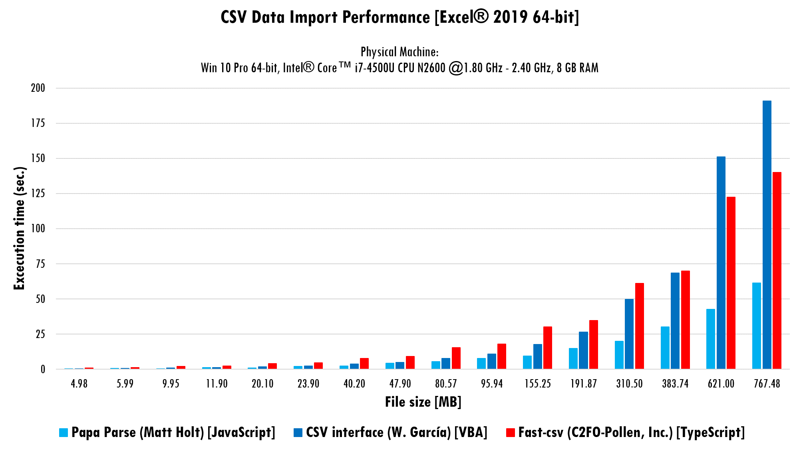
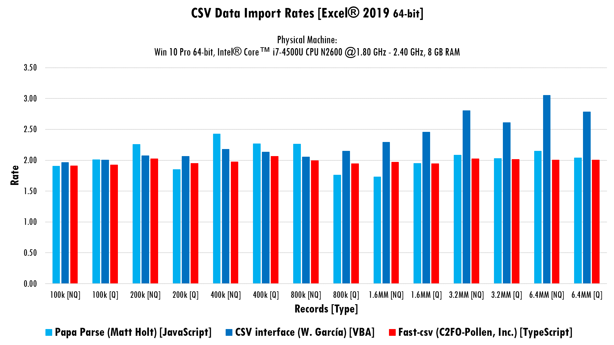
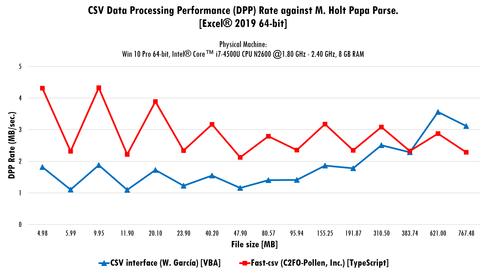
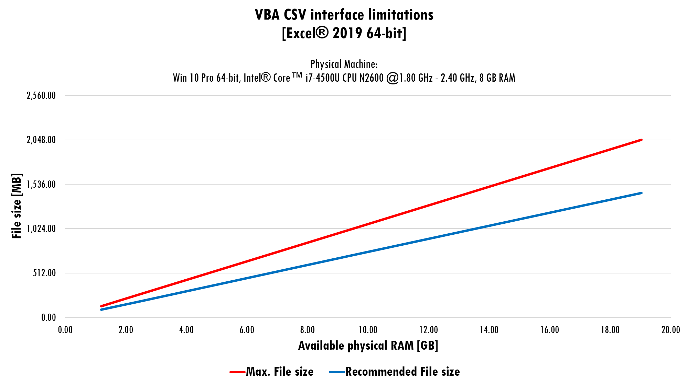

# Experimental results
{: .fs-9 }

---

VBA is the version of Visual Basic that ships with Microsoft Office. At this time, it's impossible to un-stick VBA code from host application main limitations. For example, an Excel Worksheet is limited to 1,048,576 rows, if user need more storage space a new Worksheet is required.

At the same time, Microsoft aims the 32-bit version of Excel is [limited to 4GB of RAM](https://docs.microsoft.com/en-us/office/troubleshoot/excel/laa-capability-change), on x64 OS’s, for most recent versions and to 2GB for versions up to 2013. Again, VBA can’t avoid this limitation.

By the fact CSV interface works with strings, and [VBA uses 10 bytes + string length](https://docs.microsoft.com/en-us/office/vba/language/reference/user-interface-help/data-type-summary) for store this data type and this can let user's application run out of memory, it’s crucial to set some boundary over the file size users can work from the CSV interface class module. 

To achieve this, the first step is to study the performance of the VBA CSV interface when parsing files with varying size, and then establish the recommended file size in function of the RAM installed in the user’s computer. However, a lot of assumptions are involved here and the most dangerous one is: \[the results obtained in a test runed in a Windows x64 OS with 8GB RAM, can been used as a reference to infer that the percent (%) of the used memory controls the code performance when work with “big” files on VBA\]. 

The previous assumption conduces to the following affirmation: as the peak memory used reach the limit of the available memory, VBA experiments a performance loss.

To accomplish the first step of this analysis, we’ll use two solutions developed in different programing language. The first one is [Papa Parse]( https://www.papaparse.com/), a hyper fast JavaScript solution developed by [Matt Holt]( https://github.com/mholt). The second one is [Fast-csv]( https://c2fo.io/fast-csv/), a TypeScript solution, with great reputation, developed by [Pollen, Inc]( https://c2fo.com/). At a glance, we can assume that the two contenders will easily beat CSV interface in performance by the fact VBA isn’t a modern programing language like its competitors. And, at this point, all of this is right. Papa Parse will be runed on Firefox Browser v83.0 64-bit using the demo page available at [this site](https://www.papaparse.com/demo), in the other hand, Fast-csv will be runed on the Node.js v14.15.1. console using the provided benchmark code, with a little tweak.

The below graphs show the benchmark results for a set of CSV files with size ranked from almost 5 MB to almost 768 MB. Readers can download all the CSV used for this test [here.](/csv-data/assets.zip)

>⚠️**Caution**
>{: .text-grey-lt-000 .bg-green-000 }
>The *assets.zip* file contains a .7z file inside. At least 2.70 GB of free disk space is required in order to decompress the files to the computer's hard drive.
{: .text-grey-dk-300 .bg-yellow-000 }

Up to here, we encountered the fact VBA CSV interface is a great contender when working with CSV files with size ranked from nearly 5 MB to nearly 384 MB.

Let's see what's happened with the performance when the CSV files doubles its size.

The data shows that the size of the CSV file and the time required to parse them have a direct proportionality ratio: duplicating the size doubles the time required to parse the file. In the case of VBA CSV interface, proportionality is maintained only with CSV files with size in the range from almost 5 MB to almost 96 MB. Starting with CSV with more than 96 MB of content, when the file size is doubled, the time required to parse the next file is almost tripled.

Papa Parse was the tested faster solution, of course, VBA imposes a limited file size range. But, broadly speaking, we can say that when a user needs to work with really big CSV files Fast-csv can do the work as faster as Papa Parse can do it. Let’s see the next graph.

## CSV file size considerations

Due an analysis of the experimental results, using regression and direct proportionality ratios, the VBA CSV interface is supposed to be suitable to use at the limits shown in the below graph.

The above experimental results make smooth to arrive to the following conclusions:

* VBA CSV interface is suitable to almost any Microsoft Office Excel user. It can handle considerably large CSV files without any problem.
* As the size of the CSV increases, VBA CSV interface has a performance drop.
* With each available GB of RAM VBA CSV interface can parse CSV files sized up to 107.61 MB, then, the max file size for a specific machine can be estimated with the formula \[107.61 * Available RAM\] (results in MB).
* VBA CSV interface can work at high performance with files sized to almost \[75.45 * Available RAM\]  (results in MB).
* Parse files sized over \[107.61 * Available RAM\]  (results in MB) makes the VBA CSV interface a not reliable alternative.

>⚠️**Caution**
>{: .text-grey-lt-000 .bg-green-000 }
>Each the formulation presented here is experimental and can be wrong due the assumptions involved. There is a real chance to experiment unexpected behavior. User need to remember that parse a 2 GB sized CSV file can require up to 20 GB of Available RAM.
>
>The target CSV can't have size greater than 2GB. This because VBA CSV interface use `LONG` datatype when parsing. So, if you want to process files larger than 2GB, you'll need to use another solution instead.
{: .text-grey-dk-300 .bg-yellow-000 }